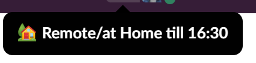

# slack-status-updater
Set your status on Slack based on the WiFi network you are connected to (with a few adjustments 🤓).

## How does it work?

The script checks periodically the WiFi network name (SSID) you are connected to and sets your status on Slack according to the mapping defined in [config.js](./config.js).
Screenshot example: 

## Prerequisites

### Slack-API-Token
You need to obtain a Slack token for your account from https://api.slack.com/apps.
There you need to do the following:
1. "Create New App"
    - "From scratch"
    - select a name and a workspace and click on "Create App"
2. Go to the Section "Add features and functionality" and click on "Permissions"
3. Add the following scopes in the section "User Token Scopes":
    - ```users.profile.read```
    - ```users.profile.write```
    - ```users:write``` (since v2.0.0)
4. Scroll back up and install the "App" to your workspace
5. Now you should be able to see your Token in the section

### Node.js
You also need to have node.js installed to run the script. Currently it works on Windows and macOS only.
Install nodejs using this link: https://nodejs.org/en/download/

### Further steps
- Clone or download this repository
- Install dependencies with `npm install` from outside the root directory of the pathy you cloned it to
- Copy and paste the token into [config_example.js] slackToken variable
- Rename [config_example.js] -> [config.js]
- Run with `npm start`

## Things to know
Be careful with defining a updateInterval value that is too low. Slack will block requests for status change if done too frequently.
Run this program as a service (in Windows) using NSSM (the Non Sucking Service Manager) at http://nssm.cc/
Check the Indivirtual blog for more information on how to do this: https://blog.indivirtual.nl/update-slack-status-automatically-using-node-js

## Shoutout 📢
Thanks for all previous contributors of the app, this was forked from and gave me the baseline to do the improvements.
Thanks to Lukasz Wiktor as well, as it seems his repo was the real baseline:
https://github.com/LukaszWiktor/slack-status-based-on-wifi-name
## Motivation for forking 💡
First of all i was missing an option to keep manually set statuses from within Slack, such as Sick/Vacation or Coffee-breaks etc.
Thats, why i've implemented a checkup, if the status, that is currently setup, is a manual one. This option can be turned on/off in the config with the new parameter 
<span style="color:cyan">**_overwriteManualStatus_**</span>.
I also renamed the name of the repo, since the intention is to also plan statuses for the fuuture, like abscences during  vacations for the whole year.

----------------------

## Configuration 
| Syntax | Description |
| --- | --- | 
| ```statusByWiFiName```: (*object*) | entries of personal wifi SSIDs as properties. To add an SSID and its setting, simply add the Name of it and open a new subobject with the properties: [status_text] and [status_emoji] |
|```showWorkingHoursInStatusText```: (*boolean*) | if set to true, the working hours are displayed in the status text example:  |
| ```awayOutsideWorkingHours```: (*boolean*) | if set to true, users presence is set to away outside the working hours |
|```workingDays```: (*array of numbers*) | allowed values 0 - 6 separated by comma |
| ```workingHoursFrom```: (*number*) | allowed values: 0 - 24 |
| ```workingMinutesFrom```: (*number*) | allowed values: 0 - 59 |
| ```workingHoursTo```: (*number*) | allowed values: 0 - 24 |
| ```workingMinutesTo```: (*number*) | allowed values: 0 - 59 |
| ```overwriteManualStatus```: (*boolean*) | if set to true, a manual set status will be overwritten after the next interval |
| ```updateInterval```: (*number*) | update interval in miliseconds |


